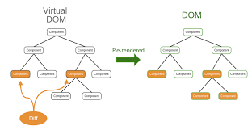
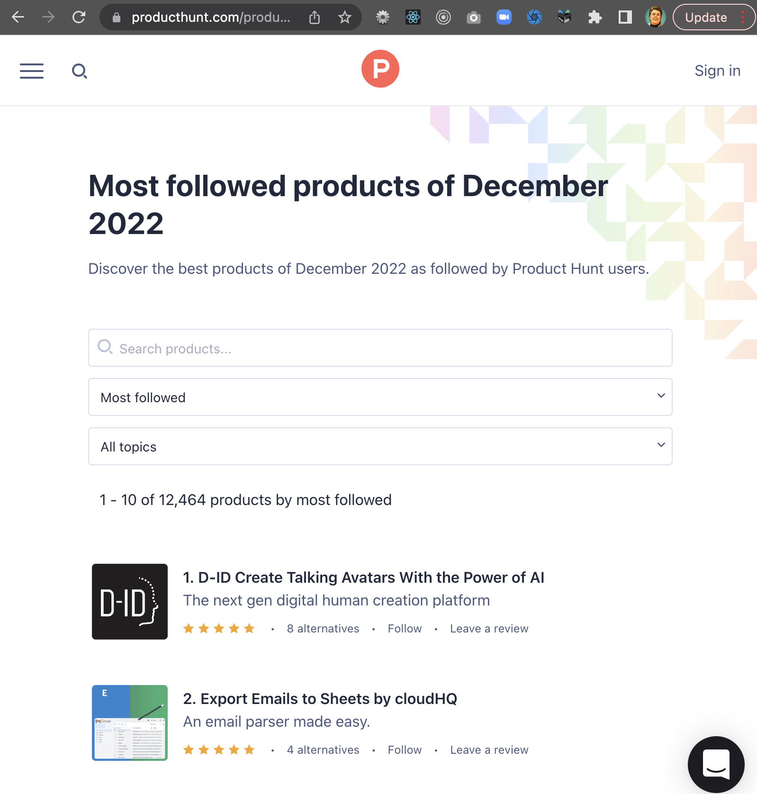
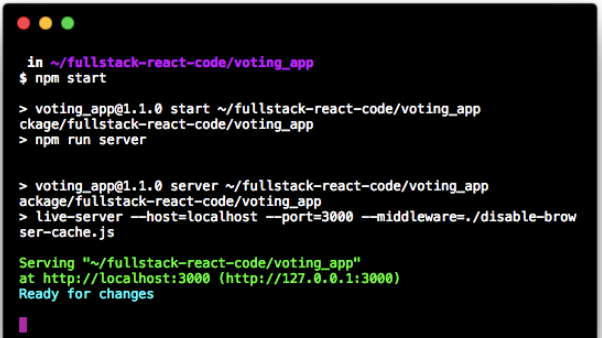
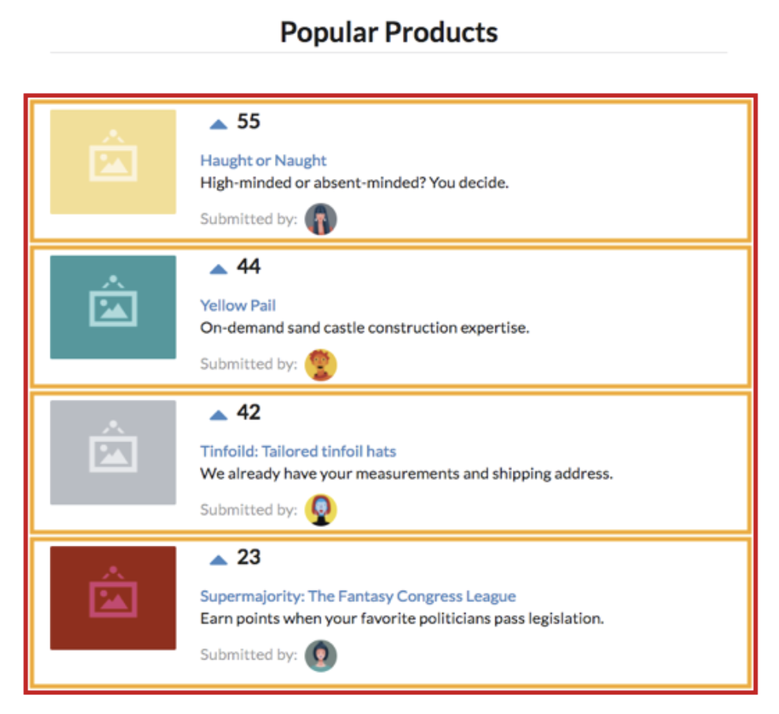

# Setup and Rendering with React

### Let's Get Excited!

Writing web applications with React is fun. You are going to learn how to build real React applications fast.

If you’ve written client-side JavaScript before, you’ll find React refreshingly intuitive.
If this is your first serious dive into the `front-end`, you’ll be blown away at how quickly you can create something to get excited about.

So strap in! You’re beginning the journey to become a React programmer and have a lot of fun along the way. Let’s go!

## Overview

React is a library for performing efficient updates to a web page; a process referred to as `rendering`. To use React, the author describes how a given application state should be displayed and React takes care of manipulating the browser's `DOM` to match that state. This removes the error-prone process of manually updating parts of the DOM when your application state changes. With React, you merely render **everything** again, and React makes sure only to make the minimal changes necessary.

## One-Way vs. Two-Way Data Flow

In contrast with other tools that also help with DOM manipulation, such as Angular, React embraces the concept of **one-way data flow**. This means when using React, the view is generated by React, but does not communicate directly back to it. Instead, actions generated by your views such as clicks and key presses must go through an intermediate layer which React calls the `dispatcher`. This dispatcher decides how to interpret the action and what changes, if any, should be made to your application `state`. React documentation refers to the `state` of your application as the `store`.


Figure 1-1: React Data Flow

React does not have an opinion on what dispatcher and store you should use, it only provides the capability to convert your `state` into updates for the browser. You can write your own dispatcher and store, or use one of the many options available as open source projects. In this course, you will start off writing your own and then transition into using **Redux**.

## Virtual DOM



React is designed to use the `render` function to output content the page actually contains. This may involve adding elements, removing elements, or updating elements in-place. These are the kind of operations traditionally jQuery is used for. Unfortunately, making updates to the DOM can be slow, and multiple unnecessary updates can severely impact the responsiveness of a site, especially as the number of updates grows. This was one of the driving factors for motivating Facebook to develop **React**. With React they were able to minimize the amount of updates being performed and bring the performance of the page back to a reasonable point.

To build a minimal list of operations to be performed on the DOM, React needs to to compare what is currently in the DOM to what should be there. To support this, the `render` function does **not** output HTML or make changes to the DOM directly. Instead, it outputs a data structure known as a **Virtual DOM**. This virtual version of the DOM is greatly simplified and very fast to work with. React then checks the virtual DOM against the real DOM in the browser and makes a list of updates to perform. Since DOM manipulation is a slow process, this ensures only elements genuinely changed are updated. There are many Virtual DOM based systems available in the JavaScript ecosystem, but **React** is by far the most commonly used.

## Review

Below is a quiz to review the recently covered material. Quizzes are not graded.

#### Question 1 of 6

React is a library used to render web pages efficiently.

True [ ]

False [ ]

Solution: True

#### Question 2 of 6

React manipulates the browser's DOM to match the shape of the content based upon the application state.

True [ ]

False [ ]

Solution: True

#### Question 3 of 6

Each time React renders a web page, only the minimal, necessary changes are made.

True [ ]

False [ ]

Solution: True

#### Question 4 of 6

React compares the virtual DOM with the actual browser DOM to determine what should be changed.

True [ ]

False [ ]

Solution: True

#### Question 5 of 6

With React, actions on a web page like clicking a button are routed through a ********\_********.

    A. DOM
    B. store
    C. dispatcher
    D. library

Solution: C. dispatcher

#### Question 6 of 6

The state of your web application in React is referred to as the ******\_\_******.

    A. DOM
    B. store
    C. dispatcher
    D. library

Solution: B. store

## Frameworks and Libraries

You may have encountered the terms `framework` and `library`. Both of these terms describe "code someone else wrote that is not part of your application". Generally speaking, a library is a collection of code functionality meant to be integrated into your application. Each part of a library is relatively isolated and can be brought in piece-by-piece. Frameworks, on the other hand, work by having your application embedded **inside** them. In this way, frameworks dictate much, if not all, of how your application is structured. This has both benefits and drawbacks.

### Benefits

By dictating much of how your application will work, `frameworks` are great at taking shortcuts by providing simpler ways of adding difficult functionality to your projects. It also reduces the amount of work you need to get started on a project. A framework "spins up" a fully dunctional starter code package, where you them make changes to create your desired application.

`Libraries`, on the other hand, don't dictate how they are used. When working on a project, you choose how to bring them into your application and what parts you would like to use. You must "wire together" all the necessary parts yourself, which often means getting started with a library is a bit slower.

### Drawbacks

When using `frameworks`, decisions are made up front which allow and define the shortcuts to be taken in a project. By doing this, it will restrict the choices you have within your project. Conventions are great until you want to break them, and in some frameworks, stepping outside the dictated path can be quite tricky.

`Libraries`, however, have very few built-in decisions, so you're at much greater liberty to use it just the way you want to. You can use a single function from a library or use all of what is provided. When using libraries, you also have the option to use multiple libraries together in ways the original authors had no intention of.

### Metaphor

Think of a `framework` as a workout class. You use the equipment the instructor wants you to use, and you do the exercises the instructor chooses. Compare this to going to a gym and having all the machines available to you. You decide what equipment to use and how to use it yourself. This is how `Libraries` work. The class is nice because you just show up and put in the work, but you trust the instructor has put together a reasonable routine. But just going to the gym and using the available equipment is useful because you get to work on exactly what you want, and for as long as you would like by making up your own workout.

#### Review

(Same as in original course)

## Your first React Web Application: Building Product Hunt

In this lesson, you will get a speed-dating introduction on React by building a simple voting application inspired by [Product Hunt](http://producthunt.com). You will become familiar with how React approaches `front-end` development and the fundamentals required to build an interactive React `app` from start to finish. Thanks to React’s core simplicity, by the end of the lesson you will be well on your way to writing a variety of fast, dynamic user interfaces.



We will focus on getting our React application up and running fast. We take a deeper look at concepts covered in this lesson throughout the course.

## React Setup

### Code Editor

As you’ll be writing code throughout this course, you need to have a code editor you’re comfortable working with. If you don’t already have a preferred editor, we recommend installing [VS Code](https://code.visualstudio.com/).

### Node.js and npm

For all the projects in this course, make sure you have a working `Node.js` development environment along with `npm`.

Please refer to the [Node.js](For all the projects in this book, we’ll need to make sure we have a working Node.js¹⁵
development environment along with npm.

Refer to the [Node.js
website](https://nodejs.org/download/) for detailed information.

#### Caution!

If you’re working on a Mac, your best bet is to install `Node.js` directly from the `Node.js` website instead of through another package manager (like
Homebrew). Installing `Node.js` via Homebrew is known to cause some issues.

The **Node Package Manager** (`npm` for short) is installed as part of `Node.js`.

To check if `npm` is available as part of your development environment, open a terminal window and type:

`npm -v`

If a version number is not printed out and you receive an error, download a `Node.js` installer that includes `npm`.

### Install Git

The application in this lesson requires `git` to install required third-party libraries. If you don’t have `git` installed, see [these instructions](https://git-scm.com/book/en/v2/Getting-Started-Installing-Git) for installing `git` on your specific operating system. After installing `git`, restart your computer.

### Browser

We highly recommend using the [Google Chrome Web Browser](https://www.google.com/chrome/) to develop
React applications. We’ll use the [Chrome Developer Toolkit](https://developer.chrome.com/docs/devtools/) throughout this course. To code along with our development and debugging we recommend downloading it now.

### Special instruction for Windows users

All the code in this course has been tested on Windows 10 with **PowerShell**.

#### Ensure **IIS** is installed.

If you are using a Windows machine and have yet to do any web development on it, you may need to install **IIS** (Internet Information Services) to run web servers locally.
See [this tutorial](http://www.howtogeek.com/112455/how-to-install-iis-8-on-windows-8/) for installing IIS.

### JavaScript ES6/ES7

The 6th edition of JavaScript is referred to as `ES6`. ` ES6` is a
significant update. It contains a wide variety of new features for JavaScript. JavaScript written in `ES6` is tangibly different than JavaScript written in ES5. `ES7`, a much smaller update that builds on `ES6`, was ratified in June 2016. `ES7` contain sonly two new features.

We want to write our code in ES6/ES7 today. But we also want our JavaScript to run on older browsers until they fade out of widespread use. We see later how we can enjoy the benefits of ES6/ES7 today while
still supporting the vast majority of the world’s browsers.

### Create Folder for course

For this course, create a folder in your `SoftwareDevelopment` folder named `FEFReact`. Please add all projects to this folder to keep yourself organized. You will be creating projects to practice the code from the lesson and projects for your Hands-On solutions. As you move through this course, you will be asked to create projects with specific names, so please add these projects into the `FEFReact` folder.

To create this folder, follow the steps below:

1.  Open up your command prompt/terminal.
2.  Run the following to navigate to your Desktop

    `cd Desktop`

3.  Next, navigate to the `SoftwareDevelopment`
    directory in your terminal.

        ```cd SoftwareDevelopment```

- You created this folder in your Front-End Foundations course. If you do not have this folder follow the directions below:

  1.  Create a root folder on your desktop and name it `SoftwareDevelopment`.

      `mkdir SoftwareDevelopment`

  2.  Next, navigate to the `SoftwareDevelopment directory` in your terminal.

      `cd SoftwareDevelopment`

4. Create a new folder within your `SoftwareDevelopment` folder and name it `FEFReact`. (This folder will hold all your coursework for this course)

   `mkdir FEFReact`

5. Then, navigate to the `FEFReact` directory in your terminal.

   `cd FEFReact`

Great! Now you have a folder where all of the projects for this course will live. Remember to create projects when asked and make sure they live in this folder!

## Getting Started

While coding along with the lesson is not mandatory, we highly recommend doing so. Playing around with examples and sample code will help enhance and strengthen concepts for real-world application.

### Previewing the application

You will be building a basic React application that will allow us to touch on React’s most important concepts at a high-level before diving into them in subsequent lessons.

Let’s start by taking a look at a working implementation of the application.

1. Download the `L01React` starter code folder.

[Starter Code](https://drive.google.com/drive/folders/1CnQF8QlyENt3AjBXk_nRkjM0PjMV89U-?usp=sharing)

2. Move folder into the FEFReact Folder.

3. Open L01React folder in VS Code.

4. Change into the voting_app folder.

`cd voting_app`

5. Use `npm` to install all dependencies.

`npm install`

6. With your dependencies installed, boot the server using the `npm start`
   command.

  `npm start`

The boot process will print some text to the console:



In addition, your browser might automatically launch and open the application. If it doesn’t,
you can view the running application at the URL http://localhost:3000:


This demo application is a site lsimilar to [Product Hunt](http://producthunt.com) or [Reddit](http://reddit.com/). These sites have lists of links users can vote on. Like those sites, in our application we can up-vote products. All products on the sites are sorted instantaneously by number of votes.

#### Tip!

The keyboard command to quit a running Node server is `CTRL+C`.

### Prepare the application

In the terminal, run `ls` to see the project’s layout:

```
ls
README.md
disable-browser-cache.js
nightwatch.json
node_modules/
package.json
public/
tests/
```

#### Tip!

If you’re running on macOS or Linux, you can run `ls -1p` to format your output as we see above.

Node applications contain a `package.json` file which specifies the dependencies of the project.
When we ran `npm install`, `npm` used our `package.json` to determine which dependencies to download and install. It installed them to the folder `node_modules/`. We explore the format of `package.json` in later lessons.

The code you will be working with is inside the folder `public/`. Look inside that folder:

```
ls public
favicon.ico
images/
index.html
js/
semantic-dist/
style.css
vendor/
```

The general layout here is a common one for web applications. Inside `public/` is `index.html`, the file we serve to browsers to request our website. As you will see shortly, `index.html` is the centerpiece of our application. It loads the rest of our application’s assets.

Let’s look inside `public/js` next.

```
ls public/js
app-1.js
app-2.js
app-3.js
app-4.js
app-5.js
app-6.js
app-7.js
app-8.js
app-9.js
app-complete.js
app.js
seed.js
```

Inside `public/js` is where you will put your application’s JavaScript. You’ll be writing your React application inside `app.js`.

#### Tip!

All projects include a `README.md` with instructions on how to
run them.

To get started, remove `app-complete.js` in ` index.html`. Now you have a blank canvas to begin working on inside `app.js`.

Open up `public/index.html` in your text editor. It should look like this:

**voting_app/public/index.html**

```
<!DOCTYPE html>
<html>

  <head>
    <meta charset="utf-8">
    <title>Project One</title>
    <link rel="stylesheet" href="./semantic-dist/semantic.css" />
    <link rel="stylesheet" href="./style.css" />
    <script src="vendor/babel-standalone.js"></script>
    <script src="vendor/react.js"></script>
    <script src="vendor/react-dom.js"></script>
  </head>

  <body>
    <div class="main ui text container">
      <h1 class="ui dividing centered header">Popular Products</h1>
      <div id="content"></div>
    </div>
    <script src="./js/seed.js"></script>
    <script src="./js/app.js"></script>
  </body>
</html>
```
We’ll go over all the dependencies being loaded under the `<head>` tag later. The heart
of the `HTML` document is these few lines here:

**voting_app/public/index.html**

```
<div class="main ui text container">
  <h1 class="ui dividing centered header">Popular Products</h1>
  <div id="content"></div>
</div>
```
#### Note!

For this project, we’re using [Semantic UI](https://semantic-ui.com/) for styling.

**Semantic UI** is a CSS framework, similar to Twitter’s [Bootstrap](https://getbootstrap.com/). It provides a grid system and some simple styling. You don’t need to know Semantic UI in this course. You will be provided all the styling code you need. At some point, you might want to check out the docs [Semantic UI docs](https://semantic-ui.com/introduction/getting-started.html) to get familiar with the framework and explore how you can use it in your own projects.


The `class` attributes here are just concerned with `style` and are safe to ignore.
Stripping those away, our core markup is more succinct:

```
<div>
  <h1>Popular Products</h1>
  <div id="content"></div>
</div>
```

You now have a title for the page `(h1)` and a `div` with an `id` of `content`. This `div` is where
you will ultimately connect your React application. You will see see soon what that means.

The next few lines of code tell the browser what JavaScript to load. To start building your own
application, remove the `./app-complete.js` script tag and content completely.

After you save your updated `index.html` and reload the web browser, you’ll see your application has disappeared.

## What’s a component?

Building a React application is all about `component`s. An individual React `component` can be thought of as a User Interface `component` in an application. You can break apart the interface of your
application into two classes of components:


**The app’s components**

We have a hierarchy of one parent component and many child components. You’ll call these `ProductList` `and Product`, respectively:

1. `ProductList`: Contains a list of product components
2. `Product`: Displays a given product

Not only do React components map cleanly to User Interface components, they are self-contained. The markup, view logic, and often component-specific style are all housed in one place. This feature makes React components **reusable**.

React’s paradigm for component data flow and interactivity is rigidly defined. In React, when the inputs for a component change, the framework simply re-renders that component. This provides a robust User Interface consistency guarantee:

**With a given set of inputs, the output (how the component looks on the page)
will always be the same.**

### Our first component

Start by building the `ProductList` component. You’ll write all your React code for the rest of this lesson inside the file `public/js/app.js`. Open `app.js` and insert the component:

**voting_app/public/js/app-1.js**

```
class ProductList extends React.Component {
render() {
return (
<div className='ui unstackable items'>
Hello, friend! I am a basic React component.
</div>
);
}
}
```

React components are **ES6** classes that extend the class `React.Component`. Here we are referencing the React variable. `index.html` loads the React library for so we’re able to reference it here:

**voting_app/public/index.html**

`<script src="vendor/react.js"></script>`

Your `ProductList` class has a single method, `render()`. `render()` is the only required method for a React component. React uses the `return` value from this method to determine what to render to the page.

| There are two ways to declare React components: <br><br><br>(1) As ES6 classes (as above)<br><br><br>(2) Function components<br><br><br>An example of using an ES6 class:<br><br><br>class HelloWorld extends React.Component {<br>      render() { return <p>Hello, world!</p>; }<br>}<br><br><br>The same component written in a “functional component” style:<br><br><br>function HelloWorld() {<br>     return <p>Hello, world!</p>;<br>}<br><br><br>At the time of writing, both types of declarations are in widespread use. While they<br><br>both do essentially the same thing, there are some important differences we’ll<br><br>get to later in the course. |
|--------------------------------------------------------------------------------------------------------------------------------------------------------------------------------------------------------------------------------------------------------------------------------------------------------------------------------------------------------------------------------------------------------------------------------------------------------------------------------------------------------------------------------------------------------------------------------------------------------------------------------------------------------------------------------|

#### Note!

You will be using **ES6** class components through much of this corse, but you’ll be using function components from time-to-time as well. While it might seem simpler to just pick one, you’ll encounter (and use) both in your real-world work. So we’ll cover both.

#### Try it!

The return value may be surprising:

**voting_app/public/js/app-1.js**

```
return (
<div className='ui unstackable items'>
  Hello, friend! I am a basic React component.
</div>
);
```

[Try it on CodePen](https://codepen.io/drbealman/pen/qBybzvY)

The syntax of the `return` value doesn’t look like traditional JavaScript. We’re using **JSX** (JavaScript eXtension syntax), a syntax extension for JavaScript written by Facebook. Using **JSX** allows you to write the markup for your component views in a
familiar, `HTML`-like syntax. In the end, this **JSX** code compiles to vanilla JavaScript.
Although using **JSX** is not a necessity, you’ll use it in this course as it plays well with React.

#### Tip!

If you aren't experienced with JavaScript, we recommend you code along and use **JSX** in your React code, too. You’ll learn the boundaries between **JSX** and **JavaScript** with continued practice and experience.

## Key Terms

Below is a list and short description of the important keywords you have learned in this lesson. Please read through and go back and review any concepts you don't understand fully. Great Work!

|      **Keyword**      |                                                    **Description**                                                    |
| :-------------------: | :-------------------------------------------------------------------------------------------------------------------: |
|         React         |                               A library for performing efficient updates to a web page.                               |
| React.createElement() | A React method that creates new elements on the page rather than having to add the elements into the index.html file. |
|    ReactDOM/client    |                            A package needed to render the React.createElement() correctly.                            |
|       render()        |           A method included in the ReactDOM/client package that allows to render elements onto the webpage.           |

## Lesson 1 Practice Hands-On

1. Start at "`Create folder for course`"
2. Code along with all instructions.
3. Save frequently.
4. Submit final `app-1.js` and `index.html`

#### Caution!

Be sure to zip and submit your entire `L01HandsOn` directory when finished!

## Add

"Drop files to upload, or click to browse"

"Submit Project" Button

## Solution

**app-1.js final**

```
class ProductList extends React.Component {
  render() {
    return (
      <div className='ui unstackable items'>
        Hello, friend! I am a basic React component.
      </div>
    );
  }
}

ReactDOM.render(
  <ProductList />,
  document.getElementById('content')
);
```

**index.html final**

```
<!DOCTYPE html>
<html>

  <head>
    <meta charset="utf-8">
    <title>Project One</title>
    <link rel="stylesheet" href="./semantic-dist/semantic.css" />
    <link rel="stylesheet" href="./style.css" />
    <script src="vendor/babel-standalone.js"></script>
    <script src="vendor/react.js"></script>
    <script src="vendor/react-dom.js"></script>
  </head>

  <body>
    <div class="main ui text container">
      <h1 class="ui dividing centered header">Popular Products</h1>
      <div id="content"></div>
    </div>
    <script src="./js/seed.js"></script>
    <script src="./js/app.js"></script>
  </body>
</html>
```
