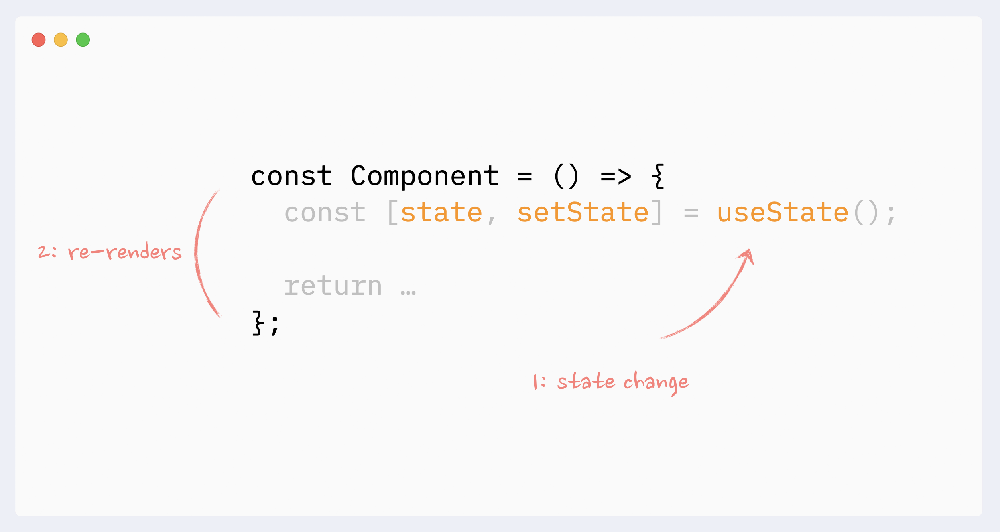

# Setup and Rendering with React

## Overview

React is a library for performing efficient updates to a web page; a process referred to as ```rendering```. To use React, the author describes how a given application state should be displayed and React takes care of manipulating the browser's ```DOM``` to match that state. This removes the error-prone process of manually updating parts of the DOM when your application state changes. With React, you merely render **everything** again, and React makes sure only to make the minimal changes necessary.

## One-Way vs. Two-Way Data Flow

In contrast with other tools that also help with DOM manipulation, such as Angular, React embraces the concept of **one-way data flow**. This means when using React, the view is generated by React, but does not communicate directly back to it. Instead, actions generated by your views such as clicks and key presses must go through an intermediate layer which React calls the ```dispatcher```. This dispatcher decides how to interpret the action and what changes, if any, should be made to your application ```state```. React documentation refers to the ```state``` of your application as the ```store```.


Figure 1-1: React Data Flow

React does not have an opinion on what dispatcher and store you should use, it only provides the capability to convert your ```state``` into updates for the browser. You can write your own dispatcher and store, or use one of the many options available as open source projects. In this course, you will start off writing your own and then transition into using **Redux**.

## Virtual DOM


React is designed to use the ```render``` function to output content the page actually contains. This may involve adding elements, removing elements, or updating elements in-place. These are the kind of operations traditionally jQuery is used for. Unfortunately, making updates to the DOM can be slow, and multiple unnecessary updates can severely impact the responsiveness of a site, especially as the number of updates grows. This was one of the driving factors for motivating Facebook to develop **React**. With React they were able to minimize the amount of updates being performed and bring the performance of the page back to a reasonable point.

To build a minimal list of operations to be performed on the DOM, React needs to to compare what is currently in the DOM to what should be there. To support this, the ```render``` function does **not** output HTML or make changes to the DOM directly. Instead, it outputs a data structure known as a **Virtual DOM**. This virtual version of the DOM is greatly simplified and very fast to work with. React then checks the virtual DOM against the real DOM in the browser and makes a list of updates to perform. Since DOM manipulation is a slow process, this ensures only elements genuinely changed are updated. There are many Virtual DOM based systems available in the JavaScript ecosystem, but **React** is by far the most commonly used.

## Review

Below is a quiz to review the recently covered material. Quizzes are not graded.

#### Question 1 of 6

React is a library used to render web pages efficiently.

True [ ] 

False [ ]

Solution: True

#### Question 2 of 6

React manipulates the browser's DOM to match the shape of the content based upon the application state.

True [ ] 

False [ ]

Solution: True

#### Question 3 of 6

Each time React renders a web page, only the minimal, necessary changes are made.

True [ ] 

False [ ]

Solution: True

#### Question 4 of 6

React compares the virtual DOM with the actual browser DOM to determine what should be changed.

True [ ] 

False [ ]

Solution: True

#### Question 5 of 6

With React, actions on a web page like clicking a button are routed through a _________________.

	A. DOM
	B. store
	C. dispatcher
	D. library

Solution: C. dispatcher

#### Question 6 of 6

The state of your web application in React is referred to as the ______________.

	A. DOM
	B. store
	C. dispatcher
	D. library	

Solution: B. store

## Frameworks and Libraries

You may have encountered the terms ```framework``` and ```library```. Both of these terms describe "code someone else wrote that is not part of your application". Generally speaking, a library is a collection of code functionality meant to be integrated into your application. Each part of a library is relatively isolated and can be brought in piece-by-piece. Frameworks, on the other hand, work by having your application embedded **inside** them. In this way, frameworks dictate much, if not all, of how your application is structured. This has both benefits and drawbacks.

### Benefits

By dictating much of how your application will work, ```frameworks``` are great at taking shortcuts by providing simpler ways of adding difficult functionality to your projects. It also reduces the amount of work you need to get started on a project. A framework "spins up" a fully dunctional starter code package, where you them make changes to create your desired application.

```Libraries```, on the other hand, don't dictate how they are used. When working on a project, you choose how to bring them into your application and what parts you would like to use. You must "wire together" all the necessary parts yourself, which often means getting started with a library is a bit slower.

### Drawbacks

When using ```frameworks```, decisions are made up front which allow and define the shortcuts to be taken in a project. By doing this, it will restrict the choices you have within your project. Conventions are great until you want to break them, and in some frameworks, stepping outside the dictated path can be quite tricky.

```Libraries```, however, have very few built-in decisions, so you're at much greater liberty to use it just the way you want to. You can use a single function from a library or use all of what is provided. When using libraries, you also have the option to use multiple libraries together in ways the original authors had no intention of.

### Metaphor

Think of a ```framework``` as a workout class. You use the equipment the instructor wants you to use, and you do the exercises the instructor chooses. Compare this to going to a gym and having all the machines available to you. You decide what equipment to use and how to use it yourself. This is how ```Libraries``` work. The class is nice because you just show up and put in the work, but you trust the instructor has put together a reasonable routine. But just going to the gym and using the available equipment is useful because you get to work on exactly what you want, and for as long as you would like by making up your own workout.

#### Review

(Same as in original course)

## React Setup

We discussed what React is.The next step is to create a starter project. You will be working in this project throughout the next several lessons, so it is important to not skip this page.

For this course, create a folder in your ```SoftwareDevelopment``` folder named ```FEFReact```. Please add all projects to this folder to help keep yourself organized. You will be creating projects to practice the code from the lesson and projects for your Hands-On solutions. As you move through this course, you will be asked to create projects with specific names, so please add these projects into the ```FEFReact``` folder. 

To create this folder, follow the steps below:

1. Open up your command prompt/terminal.
2. Run the following to navigate to your Desktop

	```cd Desktop```

3. Next, navigate to the ```SoftwareDevelopment``` 
directory in your terminal.

	```cd SoftwareDevelopment```

- You created this folder in your Front-End Foundations course. If you do not have this folder follow the directions below:
	1. Create a root folder on your desktop and name it ```SoftwareDevelopment```.

		```mkdir SoftwareDevelopment```

	2. Next, navigate to the ```SoftwareDevelopment directory``` in your terminal.

		```cd SoftwareDevelopment```
4. Create a new folder within your ```SoftwareDevelopment``` folder and name it ```FEFReact```. (This folder will hold all your coursework for this course)

	```mkdir FEFReact```

5. Then, navigate to the ```FEFReact``` directory in your terminal.

	```cd FEFReact```

Great! Now you have a folder where all of the projects for this course will live. Remember to create projects when asked and make sure they live in this folder!


## Project Setup

We will now start getting familiar with probably the most important topic of this course, namely the React-library. Let's start off by making a simple React starter application as well as getting to know the core concepts of React.

The easiest way to get started by far is by using a tool called ```create-react-app```. It is possible (but not necessary) to install ```create-react-app``` on your machine if the ```npm``` tool that was installed along with Node has a version number of at least 5.3.

Let's create an application called ```ReactL01``` and navigate to its directory.

```
cd FEFReact
npx create-react-app ReactL01
cd ReactL01
```
To install the required Node Library;

```npm install```

This takes a while so be patient and wait until it finishes.

**Caution!**

If you are getting this error ```saveError ENOENT: no such file or directory, open '/Users/username/Desktop/React-Course/test/package.json```, it means you are not in the correct directory with a ```package.json file```. Please make sure you are in the correct directory.

Now let's run the application.

```npm start```

By default, the application runs on localhost port 3000 with the address http://localhost:3000

Your default browser should launch automatically. Open the browser console immediately. 


**Tip!**

You can stop this process by pressing ```Control + C``` in the terminal, but for now, keep the server running.

While working on this course, you will want to have the ```npm start``` process running, since it takes care of packaging up files needed to view the project in your browser. When you make a change in the project, you will see new text appear in the terminal and the browser window you launched will reload automatically. This is a process called hot reloading and is very useful when developing as it lets you see your changes very quickly.

### src

The source code of the application resides in the ```src``` folder. Let's edit the default code already in the starter application so the contents of the file ```index.js``` now look like:

```
import React from 'react'
import ReactDOM from 'react-dom/client'

import App from './App'

ReactDOM.createRoot(document.getElementById('root')).render(<App />)
```

and edit the file ```App.js``` to like this;

```const App = () => (
  <div>
    <p>Hello world</p>
  </div>
)

export default App
```

Delete the following default files as we don't need them just yet. 

- ```App.css```, 
- ```App.test.js```, 
- ```index.css```, 
- ```logo.svg```, 
- ```setupTests.js``` and 
- ```reportWebVitals.js``` 

If you end up with the following error:


You are using a React version older than the current version **18**.

The solution is to change ```index.js``` as follows:

```
import ReactDOM from 'react-dom'
import App from './App'

ReactDOM.render(<App />, document.getElementById('root'))
```

You may need to do the same for your other projects if the error pops up.


#### Component




The file ```App.js``` now defines a React component with the name ```App```. The code now on the final line of file ```index.js```

```
ReactDOM.createRoot(document.getElementById('root')).render(<App />)
```
renders its contents into the ```div``` element, defined in the file ```public/index.html```, having the ```id``` value ```'root'```.

By default, the file ```public/index.html``` doesn't contain any HTML markup visible in the browser. You can try adding some HTML to the file. However, when using React, all content that needs to be rendered is usually defined as React **components**.

Let's take a closer look at the code defining the **component**:

```
const App = () => (
  <div>
    <p>Hello software development world!</p>
  </div>
)
```

As you probably guessed, the component will be rendered as a ```div``` tag, which wraps around a ```p``` tag containing the text ```Hello software development world!```.

Technically the component is defined as a JavaScript **function**. The following is a ```function``` (which does not receive any ```parameters```):

```
() => (
  <div>
    <p>Hello world</p>
  </div>
)
```

The function is then assigned to a constant variable ```App```:

```const App = ...```

There are a few ways to define functions in JavaScript. Here we will use arrow functions,```=>```, which are described in a newer version of JavaScript known as ECMAScript 6, also called ES6.

Because the function consists of only a single expression we have used a code shorthand, which represents this piece of code:

```
const App = () => {
  return (
    <div>
      <p>Hello software development world!</p>
    </div>
  )
}
```

In other words, the function returns the value of the expression.

The function defining the component may contain any kind of JavaScript code. 

Now modify your component to be as follows and observe what happens in the console:

```
const App = () => {
  console.log('Hello from your component')
  return (
    <div>
      <p>Hello software development world!</p>
    </div>
  )
}
```

It is also possible to render dynamic content inside of a component.

Now modify your component as follows:

```
const App = () => {
  const now = new Date()
  const a = 10
  const b = 20

  return (
    <div>
      <p>Hello software development world, it is {now.toString()}</p>
      <p>
        {a} plus {b} is {a + b}
      </p>
    </div>
  )
}
```

Any JavaScript code within the curly braces ```{}``` is evaluated and the result of this evaluation is embedded into the defined place in the HTML produced by the component.

## Rendering with React

A React Element is the smallest building block in React. The virtual DOM is a tree structure comprised of a ```root``` element that contains other elements.


 This tree of virtual DOM elements is immutable, meaning it can't be changed after creation. This allows React to keep previous versions of the virtual DOM to compare against when updates are made to help ensure only the minimal amount of work is performed.

### Project Structure

Open up the ```ReactL01``` project you previously created. You will be following along in this lesson and adding code to this project. Under the public folder, you should see an ```index.html``` file. After opening the file, you should see the following:

**index.html** file:

```
<!doctype html>
<html>
    <head>
        <title></title>
    </head>
    <body>
        <div id="root"></div>
        <script src="bundle.js"></script>
    </body>
</html>

```

#### JSX

<<<<<<< HEAD

=======


>>>>>>> 082830045b524543beea57d8c3c3a8186845dcd6

It seems like React components are returning HTML markup. However, this is not the case. The layout of React components is mostly written using ```JSX```. Although ```JSX``` looks like HTML, we are actually dealing with a way to write JavaScript. Under the hood, ```JSX``` returned by React components is compiled into JavaScript.

After compiling, our application looks like this:

```
const App = () => {
  const now = new Date()
  const a = 10
  const b = 20
  return React.createElement(
    'div',
    null,
    React.createElement(
      'p', null, 'Hello world, it is ', now.toString()
    ),
    React.createElement(
      'p', null, a, ' plus ', b, ' is ', a + b
    )
  )
}
```

The compilation is handled by Babel. Projects created with ```create-react-app``` are configured to compile automatically. We will learn more about this topic a bit later in the course.

It is also possible to write React as "pure JavaScript" without using JSX. Although, nobody with a sound mind would actually do so.

In practice, **JSX** is much like HTML with the distinction that with **JSX** you can easily embed dynamic content by writing appropriate JavaScript within curly braces ```{}```. The idea of **JSX** is quite similar to many templating languages, such as Thymeleaf used along with Java Spring, which are used on servers.

**JSX** is "XML-like", which means every tag needs to be closed. For example, a ```newline``` is an empty element, which in HTML can be written as follows:

```<br>```

but when writing **JSX**, the tag needs to be closed:

```<br />```


## ReactDOM & First React Element

### Create Element

The ```React.createElement()``` method is very useful because it creates new elements for you on the page rather than having to add the elements into your ```index.html``` file.

Below, the ```React.createElement()``` method takes in three parameters: ```type```, ```props```, and ```children```.

```
import React from 'react';

React.createElement('h1', {}, 'Hello Software Development World!');
```


In the above ```createElement()``` method, the type is the ```HTML``` tag you want to create, in this case, an ``h1`` tag. `Props` (stands for properties) are objects that get added to the element. They can be used to add `class` and `id` names or other attributes to the element created. Later on in this lesson, `props` will serve a larger purpose. For the current example, this object is empty to visualize creating a basic element. Later on, you will see it being used. **Children** are zero or more elements nested inside the element. In this case, you are providing some plain text as a child of the `h1` tag.

Great! If you add the new `createElement()` method to your code, nothing will happen. That is because you are missing a piece to make this code work.

### ReactDOM

`createElement` builds a virtual DOM element, but to get React to update the page based on it, you must use the `render` function from the `react-dom/client` package. To start, you need to import the ReactDOM package as you did with React itself. Add the import statement so your code now looks like below:

**src/index.js file**:

```
import React from 'react';
import ReactDOM from 'react-dom/client';

import App from './App';

React.createElement('h1', {}, 'Hello Software Development World!');

ReactDOM.render(<App />, document.getElementById('root'))
```

Next, you need to add the `render()` function  included in the `ReactDOM` package. `render(`) has two parameters. The first parameter is what you would like to render on the page. In this case, you want to render the `React.createElement('h1', {}, 'Hello Software Development World!')`; method you already have in your code. The second parameter is where you would want to render the `createElement()` method. If you remember, there is a `<div>` in the HTML file with an `id` of `root`. This is where you are going to render your newly created `h1` element by using `document.getElementById('root')`.

Create the `ReactDOM.render()` method and move the `React.createElement('h1', {}, 'Hello Software Development World!')`; inside it along with the `document.getElementById('root')`. Your `index.js` should now look like below:

**src/index.js file**:

```
ReactDOM.render(<App />, document.getElementById('root'))
```
#### Caution!

Be careful to notice there is comma after the `createElement()` method instead of a semicolon. If you forget to change this, you will get an error.

The above code tells React to find an element on the page with an `id` of `root` and replace its contents with your newly created element.

#### Try It!

Add the above code to your `index.js` file and navigate to `localhost:8080`. The page will automatically update and you should now see "Hello Software Development World!".

#### Review

(Use current review)

### Props and Children

Time to dive a little bit deeper in how you can use `props` and `children` in the `React.createElement()` method.

First, you will begin with **Children**. You will be continuing with the code you have previously written in this lesson.

### Children

Now you want to render the created `<h1>` element inside of a new element. First, you need to create the new element (`<div>` in this case) in a new `React.createElement()` method. Again, you will be using an empty object as `props`. You then set the `<h1>` element you created earlier as a child (the third parameter) of the new `<div>` element.

#### Try It!

Try creating this new element within the `ReactDOM.render()` method. See what how close you can get and if you get stuck, the code is located below.

**src/index.js file**:

```
import React from 'react';
import ReactDOM from 'react-dom/client';

ReactDOM.render(
  React.createElement('div', {}, React.createElement('h1', {}, 'Hello Software Development World!')),
  document.getElementById('root')
);
```

### Props

Now, you will look at an example of adding a class name to the `<h1>` element you created. The syntax for this is shown below:

**src/index.js file**:

```
import React from 'react';
import ReactDOM from 'react-dom/client';

ReactDOM.render(
  React.createElement(
    'div',
    {},
    React.createElement('h1', { className: 'flowers' }, 'Hello World!')
  ),
  document.getElementById('root')
);
```

As you can see above, you added a class name of `flowers` to the `<h1>` tag that lives within a `<div>`. It is fairly simple; you just need to know the attribute name within React. If you used the word `class` instead of `className`, you would get an error. That is because the `class` keyword is tied directly to JavaScript and will not work in React.

Another example would be to use the `a` (anchor) element which requires using the `href` attribute. The below code creates an a element which then redirects the user to `www.google.com`.

**src/index.js file**:

```
import React from 'react';
import ReactDOM from 'react-dom/client';

ReactDOM.render(
  React.createElement(
    'a',
    { href: 'https://www.google.com' },
    'Take me to Google.com!'
  ),
  document.getElementById('root')
);
```

#### Caution!

Notice how the `href` to `www.google.com` is written as "https://www.google.com". `The https://` will ensure the user is taken to that specific website. If it was written like "www.google.com", React would try and point you to that path within the project rather then on the web.

#### Additional Info!

If you would like to read more about the attribute names used in `React.createElement`, please visit: [ReactJS](https://reactjs.org/docs/dom-elements.html).

#### Review

(Use current review)

### More Advanced Rendering

Let's look at creating some React elements based on slightly more complex elements.

### Render Multiple Child Elements

If you wanted to render an unordered list of different types of fruit, you would do so in HTML like below:

**index.html file**:

```
<ul>
  <li>Apples</li>
  <li>Oranges</li>
  <li>Mangos</li>
</ul>
```
How would you do that using `React.createElement()`? First, you would need to note what element you are creating, in this case, a `<ul>` element. Next, you would add any properties. For this example, continue using an empty object. Then, you would need three more `React.createElement()` methods to create the elements of each of the `<li>` elements along with the empty object and the name of each of the fruits.

#### 
Try It!
Try creating these new elements within the `ReactDOM.render()` method. See how close you can get and if you get stuck, the code is located below.

**src/index.js file**:

```
import React from 'react';
import ReactDOM from 'react-dom';

ReactDOM.render(
  React.createElement(
    'ul',
    {},
    React.createElement('li', {}, 'Apples'),
    React.createElement('li', {}, 'Oranges'),
    React.createElement('li', {}, 'Mangos')
  ),
  document.getElementById('root')
);
```

After adding the above code to your `index.js` file, navigate back to `localhost:8080`. You should now see an unordered list of three fruits as shown below:

- Apples
- Oranges
- Mangos

**Tip!**

Notice how the `ul` element has three `createElements` within. You can create many child elements within an element, like you did above.

### Complex Element Nesting

Now, what if you wanted to add nested lists to show the price of each of the fruits? In HTML, you would do it like below:

**index.html file**:

```
<ul>
  <li>Apples</li>
    <ul>
      <li>$1.00 per lb</li>
    </ul>
  <li>Oranges</li>
    <ul>
      <li>$.70 per lb</li>
    </ul>
  <li>Mangos</li>
    <ul>
      <li>$2.00 per lb</li>
    </ul>
</ul>
```

If you want to do this in React, you have to create elements within each of the `<li>` elements within the `<ul>` element. This will create nesting within the list. The code is shown below:

**src/index.js file**:

```
import React from 'react';
import ReactDOM from 'react-dom';

ReactDOM.render(
  React.createElement(
    'ul',
    {},
    React.createElement(
      'li',
      {},
      'Apples',
      React.createElement(
        'ul',
        {},
        React.createElement('li', {}, '$1.00 per lb')
      )
    ),
    React.createElement(
      'li',
      {},
      'Oranges',
      React.createElement(
        'ul',
        {},
        React.createElement('li', {}, '$.70 per lb')
      )
    ),
    React.createElement(
      'li',
      {},
      'Mangos',
      React.createElement('ul', {}, React.createElement('li', {}, '$2.00 per lb'))
    )
  ),
  document.getElementById('root')
);
```

Add the above code into your `index.js` file. You should now see the below:

- Apples
	- $1.00 per lb
- Oranges
	- $.70 per lb
- Mangos
	- $2.00 per lb

### Using Variables

As with many programming tasks, you can make the problem easier to tackle by breaking it down a bit. In this case, you can break out some of the parts you are rendering into `variables`.

Now, consider how your code would look if you set each of the fruit `React.createElement()` methods to a `variable`.

**src/index.js file**:

```
import React from 'react';
import ReactDOM from 'react-dom';

const apples = React.createElement(
  'ul',
  {},
  React.createElement('li', {}, '$1.00 per lb')
);
const oranges = React.createElement(
  'ul',
  {},
  React.createElement('li', {}, '$.70 per lb')
);
const mangos = React.createElement(
  'ul',
  {},
  React.createElement('li', {}, '$2.00 per lb')
);

ReactDOM.render(
  React.createElement(
    'ul',
    {},
    React.createElement('li', {}, 'Apples', apples),
    React.createElement('li', {}, 'Oranges', oranges),
    React.createElement('li', {}, 'Mangos', mangos)
  ),
  document.getElementById('root')
);
```

That certainly cleans up your code! If you navigate to `localhost:8080`, it will update the page but it will look exactly the same. How about you take it a step further. Now, you want to create variables for each of the prices to then use in each of the fruit variables. Consider below:

**src/index.js file**:

```
import React from 'react';
import ReactDOM from 'react-dom';

const applesPrice = React.createElement('li', {}, '$1.00 per lb');
const apples = React.createElement('ul', {}, applesPrice);

const orangesPrice = React.createElement('li', {}, '$.70 per lb');
const oranges = React.createElement('ul', {}, orangesPrice);

const mangosPrice = React.createElement('li', {}, '$2.00 per lb');
const mangos = React.createElement('ul', {}, mangosPrice);

ReactDOM.render(
  React.createElement(
    'ul',
    {},
    React.createElement('li', {}, 'Apples', apples),
    React.createElement('li', {}, 'Oranges', oranges),
    React.createElement('li', {}, 'Mangos', mangos)
  ),
  document.getElementById('root')
);
```

#### Caution!

Notice how the variables for the fruit's pricing are located above each of the fruit variables. This is because code is read **from top to bottom**. So, if the pricing variables were located under the fruit variables, they would not be read in time to render within the fruit variables.

Using variables this way can help reduce the amount of nesting needed, but it is not the most ideal way to handle this. During the next lesson, you will look further at the templating system named JSX we briefly mentioned earlier, designed to make this process more natural to work with.


#### Additional Info!

If you would like to read more about this subject, please visit [Facebook's React documentation on displaying elements](https://reactjs.org/docs/rendering-elements.html).


#### Review

(Use current review)

## Key Terms

Below is a list and short description of the important keywords you have learned in this lesson. Please read through and go back and review any concepts you don't understand fully. Great Work!

| Keyword   |  Description  |

| -------     --------------

| React     |  A library for performing efficient updates to a web page.  |

| React.createElement()  |  A React method that creates new elements on the page rather than having to add the elements into the index.html file.  |

|  ReactDOM/client  |  A package needed to render the React.createElement() correctly.  |

| render()  |  A method included in the ReactDOM/client package that allows to render elements onto the webpage.  |
