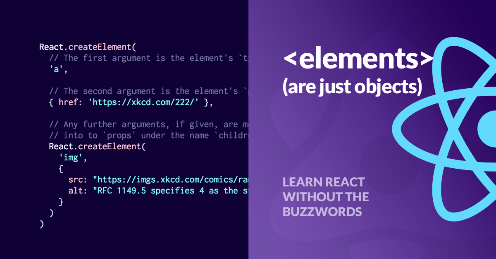

# JSX

## Overview

`const element = <h1>Hello, Software Development World!</h1>`

This syntax is neither a string nor HTML.

It is called `JSX`, and it is a syntax extension to JavaScript. We recommend using it with React to describe what the UI should look like. `JSX` may remind you of a template language, but it comes with the full power of JavaScript.

`JSX` produces React “`element`s”. We will explore rendering them to the DOM in the next section. Below, you can find the basics of `JSX` necessary to get you started.

### Why JSX?

React embraces that rendering logic is inherently coupled with other UI logic: how events are handled, how the state changes over time, and how the data is prepared for display.

Instead of artificially separating technologies by putting markup and logic in separate files, React separates concerns with loosely coupled units called “`components`” that contain both. We will come back to components later, but if you’re not yet comfortable putting markup in JavaScript, this might convince you otherwise.

React doesn’t require using `JSX`, but most people find it helpful when working with UI inside the JavaScript code. It also allows React to show more useful error and warning messages.

Let’s get started!

### Embedding Expressions in JSX

In the example below, we declare a variable called `name` and then use it inside JSX by wrapping it in curly braces:

```
const name = 'Vicki Bealman';
const element = <h1>Hello, {name}</h1>;
```

You can put any valid JavaScript expression inside the curly braces in JSX. For example, `2 + 2`, `user.firstName`, or `formatName(user)` are all valid JavaScript expressions.

In the example below, we embed the result of calling a JavaScript function, `formatName(user)`, into an `<h1>` element.

```
function formatName(user) {
  return user.firstName + ' ' + user.lastName;
}

const user = {
  firstName: 'Vicki',
  lastName: 'Bealman'
};

const element = (
  <h1>
    Hello, {formatName(user)}!
  </h1>
);

const root = ReactDOM.createRoot(document.getElementById('root'));
root.render(<h1>Hello, {formatName(user)}</h1>);
```

[Try it here](https://codepen.io/drbealman/pen/poZgQKy)


We split JSX over multiple lines for readability. While it isn’t required, when doing this, we also recommend wrapping it in parentheses to avoid the pitfalls of automatic semicolon insertion.

**JSX is an Expression Too**

After compilation, JSX expressions become regular JavaScript `function` calls and evaluate to JavaScript `objects`.

This means you can use JSX inside of `if` statements and `for loops`, assign it to variables, accept it as arguments, and return it from functions:

```
function getGreeting(user) {
  if (user) {
    return <h1>Hello, {formatName(user)}!</h1>;
  }
  return <h1>Hello, Stranger.</h1>;
}
```

**Specifying Attributes with JSX**

You may use quotes to specify string literals as attributes:

```
const element = <a href="https://www.reactjs.org"> link </a>;
```

You may also use curly braces  
`{}` to embed a JavaScript expression in an attribute:

```
const element = </img>;
```

Don’t put quotes around curly braces when embedding a JavaScript expression in an attribute. You should either use quotes (for string values) or curly braces (for expressions), but not both in the same attribute.

#### Warning:

Since JSX is closer to JavaScript than to HTML, React DOM uses `camelCase` property naming convention instead of HTML attribute names.

For example, `class` becomes `className` in JSX, and `tabindex` becomes `tabIndex`.

#### Specifying Children with JSX

If a tag is empty, you may close it immediately with `/>`, like XML:

```
const element = ;
```

JSX tags may contain children:

```
const element = (
  <div>
    <h1>Hello!</h1>
    <h2>Good to see you here.</h2>
  </div>
);
```

#### JSX Prevents Injection Attacks

You can embed user input in JSX:

```
const title = response.potentiallyMaliciousInput;
// This is safe:
const element = <h1>{title}</h1>;
```

By default, React DOM escapes any values embedded in JSX before rendering them. It ensures you can never inject anything that’s not explicitly written in your application. Everything is converted to a string before being rendered. This helps prevent XSS (cross-site-scripting) attacks.

#### JSX Represents Objects

Babel compiles JSX down to `React.createElement()` calls.

These two examples are identical:

```
const element = (
  <h1 className="greeting">
    Hello, world!
  </h1>
);
```

```
const element = React.createElement(
  'h1',
  {className: 'greeting'},
  'Hello, world!'
);
```

`React.createElement()` performs checks to help you write bug-free code, but essentially it creates an object like this:

```
// Note: this structure is simplified
const element = {
  type: 'h1',
  props: {
    className: 'greeting',
    children: 'Hello, world!'
  }
};
```



These **objects** are called “**React elements**”.Think of them as "descriptions of what you want to see on the screen". React reads these **objects** and uses them to construct the DOM and keep it up to date.

#### Tip:

We recommend using the “**Babel**” language definition for your editor of choice (VS Code) so both ES6 and JSX code is properly highlighted.

### Set JSX to Variables

You can assign the result of `React.createElement()` to a variable, and you can do the same with `JSX`. Instead of having the JSX code within the `ReactDOM.render()` method, you can set it to a variable and then use the variable within the `ReactDOM.render()` method. See below:

**src/index.js file**:

```
import React from 'react';
import ReactDOM from 'react-dom/client';

const groceryList = (
    <ul>
      <li>Apples</li>
      <li>Oranges</li>
      <li>Mangos</li>
    </ul>
);
createRoot(document.getElementById('root'));

ReactDOM.render(
  groceryList,
  document.getElementById('root')
);
```

It would look the same with your nested fruit/price list:

**src/index.js file**:

```
import React from 'react';
import ReactDOM from 'react-dom/client';

const groceryList = (
    <ul>
      <li>Apples</li>
        <ul>
          <li>$1.00 per lb</li>
        </ul>
      <li>Oranges</li>
        <ul>
          <li>$.70 per lb</li>
        </ul>
      <li>Mangos</li>
        <ul>
          <li>$2.00 per lb</li>
        </ul>
    </ul>
);

createRoot(document.getElementById('root'));

ReactDOM.render(
  groceryList,
  document.getElementById('root')
  ```

**src/index.js file**:

```
import React from 'react';
import ReactDOM from 'react-dom/client';

const groceryList = (
  <ul>
    <li>Apples</li>
    <ul>
      <li>$1.00 per lb</li>
    </ul>
    <li>Oranges</li>
    <ul>
      <li>$.70 per lb</li>
    </ul>
    <li>Mangos</li>
    <ul>
      <li>$2.00 per lb</li>
    </ul>
  </ul>
);

createRoot(document.getElementById('root'));

ReactDOM.render(groceryList, document.getElementById('root'));
```

### Returning JSX From a Function

You are not limited to setting the `JSX` code to only variables. You can create functions that produce React elements as well. See below:

#### Example 1

**src/index.js file**:

```
import React from 'react';
import ReactDOM from 'react-dom/client';

function groceryList(item1, item2, item3) {
  return (
    <ul>
      <li>{item1}</li>
      <li>{item2}</li>
      <li>{item3}</li>
    </ul>
  );
}

createRoot(document.getElementById('root'));

ReactDOM.render(
  groceryList('Apples', 'Oranges', 'Mangos'),
  document.getElementById('root')
);
```

In the code above, you created a `function`, called `groceryList`, that takes in 3 parameters which then returns each of those items in an HTML unordered list. You then call the `function` `groceryList` and define each of the items.

The above function is completely valid, but this is ES5 syntax. In real-world examples, you will most likely see ES6 rather than ES5.

#### Example 2

Below is what the above function will look like with ES6:

**src/index.js file**:

```
import React from 'react';
import ReactDOM from 'react-dom/client';

const groceryList = (item1, item2, item3) => {
  return (
    <ul>
      <li>{item1}</li>
      <li>{item2}</li>
      <li>{item3}</li>
    </ul>
  );
};

createRoot(document.getElementById('root'));

ReactDOM.render(
  groceryList('Apples', 'Oranges', 'Mangos'),
  document.getElementById('root')
);
```

#### Example 3

Below is how it would look with your nested fruit list:

**src/index.js file**:

```
import React from 'react';
import ReactDOM from 'react-dom/client';

function groceryList(item1, item1Price, item2, item2Price, item3, item3Price) {
  return (
    <ul>
      <li>{item1}</li>
      <ul>
        <li>{item1Price}</li>
      </ul>
      <li>{item2}</li>
      <ul>
        <li>{item2Price}</li>
      </ul>
      <li>{item3}</li>
      <ul>
        <li>{item3Price}</li>
      </ul>
    </ul>
  );
}

createRoot(document.getElementById('root'));

ReactDOM.render(
  groceryList(
    'Apples',
    '$1.00 per lb',
    'Oranges',
    '$.70 per lb',
    'Mangos',
    '$2.00 per lb'
  ),
  document.getElementById('root')
);
```
#### Example 4

In ES6:

**src/index.js file**:

```
import React from 'react';
import ReactDOM from 'react-dom/client';

const groceryList = (
  item1,
  item1Price,
  item2,
  item2Price,
  item3,
  item3Price
) => {
  return (
    <ul>
      <li>{item1}</li>
      <ul>
        <li>{item1Price}</li>
      </ul>
      <li>{item2}</li>
      <ul>
        <li>{item2Price}</li>
      </ul>
      <li>{item3}</li>
      <ul>
        <li>{item3Price}</li>
      </ul>
    </ul>
  );
};

createRoot(document.getElementById('root'));

ReactDOM.render(
  groceryList(
    'Apples',
    '$1.00 per lb',
    'Oranges',
    '$.70 per lb',
    'Mangos',
    '$2.00 per lb'
  ),
  document.getElementById('root')
);
```

#### Tip!

Keep in mind you will be using **ES6** from now on! ES5 is still valid, but ES6 is used more widely.

### Review

(Use existing review)

### Key Terms

Below is a list and short description of the important keywords you learned in this lesson. Please read through and go back and review any concepts you don't understand fully. Great Work!


